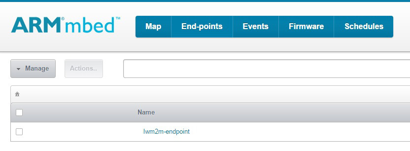

# Getting started on LWM2M Client Example

This document describes briefly the steps required to start use of LWM2M Client example application on mbed OS. LWM2M Client example application demonstrates how to register and unregister on mbed Device Server.

## Required hardware
* A [FRDM-K64F](http://developer.mbed.org/platforms/frdm-k64f/) board
* An ethernet connection to the internet
* An ethernet cable
* A micro-USB cable

## Required Software

* [Yotta](http://docs.yottabuild.org/#installing) - to build example programs
* [mbed Device Server (mDS)](#download-mbed-device-server-mds) - server example program will connect to.

## Optional Software
* [Wireshark](https://www.wireshark.org/) - for packet inspection / network debugging

## Setting up the environment
There are 3 main phases to this example:

- Download and run mDS server on computer
- Configure example mbed program with server address, build with yotta, load onto board, plug board into ethernet
- Verify board talks to server

Note: You might need to open UDP port 5683 in your computer's firewall for mDS to communicate with this example application.

### IP address setup

This example uses IPV4 to talk to the mbed Device Server(mDS). The example program should automatically grab an IPV4 address from the router when connected via ethernet.

If your network does not have DHCP enabled you will have to manually assign a static IP to the board. We recommend having DHCP enabled to make everything run smoothly.

### Download mbed Device Server (mDS)

Example application will register to mbed Device Server. You should install mDS on your local computer.

1. Download the free developer version, which is used with this example, from [ARM silver](https://silver.arm.com/browse/SEN00).
2. Unzip the package on your local computer. You should see the following files:
```
Device Server.tar.gz
Device Server Clients.tar.gz
Device Server Tools.tar.gz
Ref Apps.tar.gz
```

### Starting the mbed Device Server (mDS)

1. In the folder of the mDS package you unzipped (see [Download mbed Device Server (mDS)](#download-mbed-device-server-mds)), unzip the file `Device Server.tar.gz`. You should see the following folders:

        device-server-devel-2.2.0-606
        docs
        mbed-client-2.20-604

2. Go to the folder `device-server-devel-2.2.0-606/bin`. You will see the following start scripts:

        runDS.bat
        runDS.sh

3. Run the appropriate start script:
    - If you are using Linux OS, run the `runDS.sh` in a new shell.
    - If you are using Windows, run the `runDS.bat` in a new command prompt.

This will start mDS on your system.

#### Starting the Connected Home WebUI ("ConnectedHome" reference app)

1. In the folder of the mDS package you unzipped (see [Download mbed Device Server (mDS)](#download-mbed-device-server-mds)), unzip the file `Ref Apps.tar.gz`.

2. Go to the folder `connected-home-trial-2.2.0-610/bin`. You will see the following start scripts:

        runConnectedHome.bat
        runConnectedHome.sh

3. Run the appropriate start script:
    - If you are using Linux OS, run the `runConnectedHome.sh` in a new shell.
    - If you are using Windows, run the `runConnectedHome.bat` in a new command prompt.

This will start the WebUI on your system.

## mbed Build instructions

### Building

1. If you have not already done so, install Yotta and the needed toolchains. See the instructions at http://docs.yottabuild.org/#installing.
2. Open the file `lwm2m-client-example/test/helloworld-lwm2mclient/main.cpp`.
3. Edit your mbed Device Server's Ipv4 address and port number in place of `coap://<xxx.xxx.xxx.xxx>:5683`.
  - For example, if your server's IP address is `123.123.123.123`, you would enter `coap://123.123.123.123:5683`.
4. Open a shell (or command prompt if using Windows) and navigate to the `lwm2m-client-example` folder.
5. Run the following commands:
```
yotta target frdm-k64f-gcc
yotta build
```

A binary file should be created at `lwm2m-client-example/build/frdm-k64f-gcc/test/` named `lwm2m-client-example-test-helloworld-lwm2mclient.bin`. This will be flashed to the mbed board in the following steps.

### Flashing to target device

1. Connect the frdm-k64f to the internet using an ethernet cable
2. Connect the frdm-k64f to your computer with a micro-USB cable, being careful to use the micro-usb port labled "OpenSDA" on the bottom of the board.
3. Find the binary file named `lwm2m-client-example-test-helloworld-lwm2mclient.bin` in the folder  `lwm2m-client-example/build/frdm-k64f-gcc/test/`. Drag and drop the file onto the "MBED" drive on your computer.

The board will be programmed when the LED stops flashing. Press the reset button to run the program.

## Testing

### Log network traffic (optional)

1. Start Wireshark on the computer where the mbed Device Server is running
2. Select your ethernet interface, usually "Local Area Connection"
3. Click **Start**
4. Select the "Filter" field in the toolbar and add a filter to correspond to your mbed Device Server. Press Enter after you have entered the expression to activate the filter.
  - For example, if your server's IP address is `123.123.123.123`, you would enter `ip.addr == 123.123.123.123` and press Enter.
5. Power up your mbed board and press the reset button.

You should see the endpoint after it has registered with the mbed Device Server.

### Testing lwm2m example application with mbed Device Server

Ensure that mDS and the WebUI are running (see [Setting up the environment](#setting-up-the-environment)). Also, ensure that you have flashed the program to your mbed (see [Flashing to target device](#flashing-to-target-device)).

1. Open the WebUI by navigating to http://localhost:8082.
    - If you're working from a remote machine, you'll need to use the host machine's IP address instead of "localhost".
2. Enter `demo` as both the username and password.
3. Go to the **End-points** tab. After a short time your device should appear in the list (Refresh the page to update the list).


4. Click the endpoint name to view the registered resources. In this release, making requests to resources is not currently implemented.

