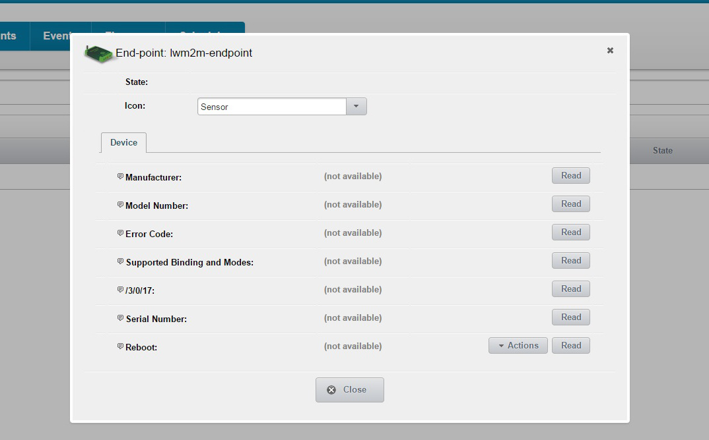

# Getting started on LWM2M Client Example

This document describes briefly the steps required to start use of LWM2M Client example application on mbed OS. LWM2M Client example application demonstrates how to register and unregister on mbed Device Server.

## Required hardware
* A [FRDM-K64F](http://developer.mbed.org/platforms/frdm-k64f/) board
* An ethernet connection to the internet
* An ethernet cable
* A micro-USB cable

## Required Software

* [Yotta](http://docs.yottabuild.org/#installing) - to build example programs
* [mbed Device Server (mDS)](#download-mbed-device-server-mds) - server example program will connect to.

## Optional Software
* [Wireshark](https://www.wireshark.org/) - for packet inspection / network debugging

## Setting up the environment
There are 3 main phases to this example:

- Download and run mDS server on computer

- Configure lwm2m-client-example application  with server address, build with yotta, load onto board, plug board into ethernet

- Verify board talks to server

Note: You might need to open UDP port 5683 in your computer's firewall for mDS to communicate with this example application.

### IP address setup

This example uses IPV4 to talk to the mbed Device Server(mDS). The example program should automatically grab an IPV4 address from the router when connected via ethernet.

If your network does not have DHCP enabled you will have to manually assign a static IP to the board. We recommend having DHCP enabled to make everything run smoothly.

### Download mbed Device Server (mDS)

Example application will register to mbed Device Server. You should install mDS on your local computer. Refer to mDS documentation for installing instructions.

You can download the free developer version, which is used with this example, from [here](https://silver.arm.com/browse/SEN00).

Download NanoService Developer package.

### Starting the mbed Device Server (mDS)

Unzip the package in your local computer. You should see following folders:

1. connected-home-trial-x.x.x
2. device-server-devel-x.x.x
3. docs
4. mbed-client-x.x.x
5. Go to `bin` folder in the  `device-server-devel-x.x.x` package that you extracted.
6. Run the start script:
    - If you are using Linux OS, run the `runDS.sh` in a new shell.
    - If you are using Windows, run the `runDS.bat` in a new command prompt.

This will start the mbed Device Server on your system.

#### Starting the Connected Home WebUI ("ConnectedHome" reference app)
7. Go to the `bin` folder in `connected-home-trial-x.x.x` that you extracted.
8. Run the start script:
    - If you are using Linux OS, run the `runConnectedHome.sh` in a new shell.
    - If you are using Windows, run the `runConnectedHome.bat` in a new command prompt.

This will start the WebUI on your system.

## mbed Build instructions

### Building
1. Connect the frdm-k64f to the internet using the ethernet cable
2. Connect the frdm-k64f to the computer with the micro-USB cable, being careful to use the micro-usb port labled "OpenSDA"
3. Install Yotta. See instructions from http://docs.yottabuild.org/#installing
4. Install needed toolchains (arm-none-eabi-gcc). Refer to the yotta installation page (in step 1 above) for instructions on how do install the toolchains.
5. cd  `lwm2m-client-example\test\helloworld-lwm2mclient`
6. Open file main.cpp, edit your mbed Device Server's Ipv4 address and port number in place of `coap://<xxx.xxx.xxx.xxx>:5683`. For example, if your server's IP address is `192.168.0.1`, you would enter `coap://192.168.0.1:5683`
7. Set up target device, `yotta target frdm-k64f-gcc`
8. Type `yotta build`

Binary file will be created to /build/frdm-k64f-gcc/test/ - folder

### Flashing to target device

You need to plug in the USB cable on J26 port on the K64F board and other end into  USB port of your computer.
Supported mbed board have drag&drop flashing capability. All you need to do is to copy the binary file to board's usb mass storage device and it will be automatically flashed to target MCU after reset.
You can find the binary file from `lwm2m-client-example/build/frdm-k64f-gcc/test/` with following name `lwm2m-client-example-test-helloworld-lwm2mclient.bin`
Press the reset button to run the program.

## Testing

### Log network traffic (optional)

1. Start Wireshark on the computer where the mbed Device Server is running
2. Select your ethernet interface, usually "Local Area Connection"
3. Click start
4. Select "filter" field on top and add a filter to correspond your mbed Device Server port.
5. Power up your mbed board

You should see the endpoint after it has registered with the mbed Device Server.

### Testing lwm2m example application with mbed Device Server

Ensure that mDS, and the WebUI are all running. These services must be started and configured before the mbed is powered up. See [Setting up the environment](#setting-up-the-environment) to set up these services.

Power up your mbed. Ensure that you have flashed the program ([Flashing to target device](#flashing-to-target-device)). Press the reset button to start the program.

1. Open the WebUI by navigating to http://localhost:8082.
    - If you're working from a remote machine, you'll need to use the host machine's IP address instead of "localhost".
2. Enter `demo` as both the username and password.
3. Go to the **End-points** tab. After a short time your device should appear in the list (Refresh the page to update the list).

4. Click the endpoint name to view the registered resources. In this release, making requests to resources is not currently implemented.

Pressing button SW2 will cause the endpoint to send an unregister message to the device server. After successful unregistration, led D12 will start blinking indicating that the application has successfully completed and the endpoint will disappear from the endpoint list in the WebUI.
